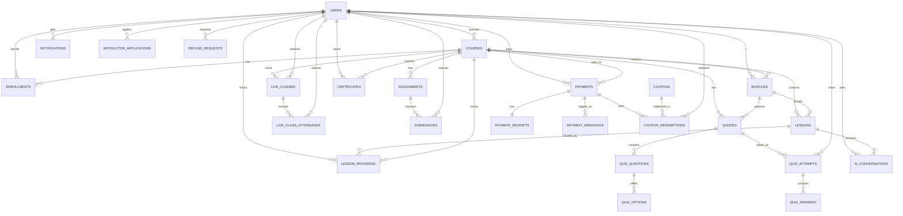

# VAREEN Academy — Entity Relationship Diagram (ERD)

**Canonical schema:** `lms_vareen/database/vareen_full_schema.sql`

## Mermaid ERD (renders on GitHub / Mermaid Live Editor)

## Table Reference

| Table | Purpose | Key relations / constraints |
|---|---|---|
| `users` | All three roles (student/teacher/admin) | `UNIQUE(email, role)`, `failed_login_attempts`, `locked_until` |
| `courses` | Courses, optional price | FK `teacher_id` → `users` (RESTRICT, no cascade) |
| `enrollments` | Student↔course | `UNIQUE(student_id, course_id)`, status ENUM incl. dropped |
| `modules` | Course chapters | FK `course_id` CASCADE |
| `lessons` | Course content/videos | FK `module_id`, `course_id` CASCADE |
| `lesson_progress` | per-lesson completion | `UNIQUE(student_id, lesson_id)`, `is_completed` |
| `live_classes` | Scheduled sessions | FK `course_id` CASCADE, `teacher_id` |
| `live_class_attendance` | Attendance ledger | `UNIQUE(live_class_id, student_id)` |
| `assignments` / `submissions` | Coursework | `UNIQUE(assignment_id, student_id)` on submissions |
| `quizzes` | Quizzes, time-limit, pass score | FK `course_id` CASCADE, `module_id` SET NULL |
| `quiz_questions` / `quiz_options` | Question banks | FK CASCADE |
| `quiz_attempts` | Attempts + grade | `evaluation` MEDIUMTEXT, status in progress→submitted→graded |
| `quiz_answers` | Per-question answers | FKs CASCADE / SET NULL |
| `ai_conversations` | Assistant Q&A log | Used for limits + audit |
| `notifications` | In-app alerts | `INDEX(user_id, is_read)` |
| `resources` | Downloadable files | FKs `lesson_id`/`course_id` |
| `password_resets` | Hashed single-use tokens | `token` UNIQUE, `expires_at` |
| `certificates` | Completion certificates | `UNIQUE(code)`, `UNIQUE(student, course)`, `revoked` |
| `settings` | Key/value admin config | PK `setting_key` |
| `instructor_applications` | Teacher hiring queue | status ENUM, `reviewed_by` → users SET NULL |
| `payments` | All payments (gateway/bank/free/coupon) | `UNIQUE(reference)`, ENUMs extended for `free`/`coupon` |
| `payment_receipts` | Receipts per payment | `UNIQUE(receipt_number)`, `pdf_path` |
| `payment_webhooks` | Gateway event audit | logs payload + signature_valid + processed |
| `coupons` / `coupon_redemptions` | Discounts/scholarships | `UNIQUE(code)`, usage counters |
| `refund_requests` | Student refund queue | status ENUM, `processed_by` → users |

## Normalization Notes

- All tables are in **3NF**: no repeating groups, every non-key column depends
  only on the full primary key, no transitive dependencies.
- `courses.teacher_id` is the only deliberate divergence from CASCADE—deleting
  an instructor must never cascade-delete student enrollments/payments.
- Hot lookups are index-covered: user email/role, enrollment(user, course),
  progress(user, lesson), payments(reference), ai_conversations(student, created_at),
  notifications(user, is_read).